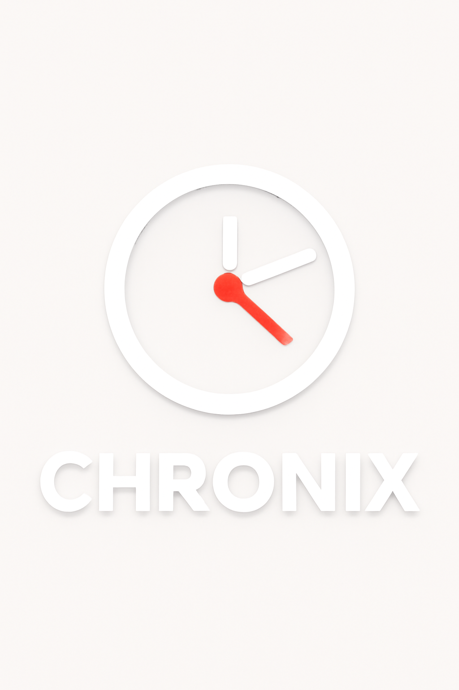
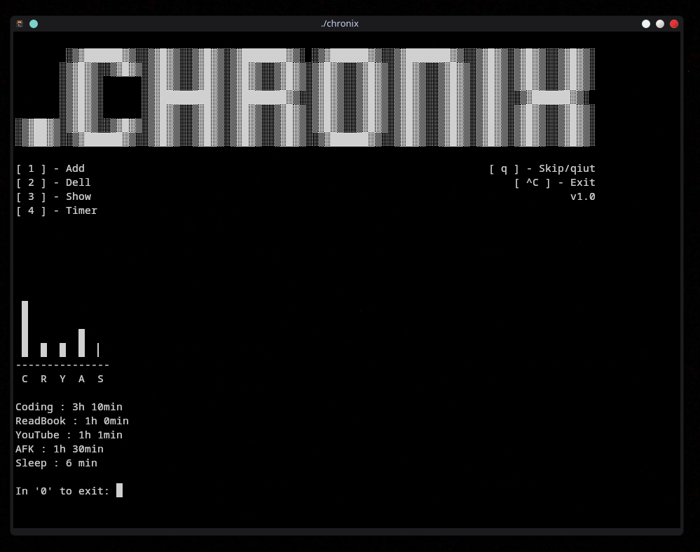
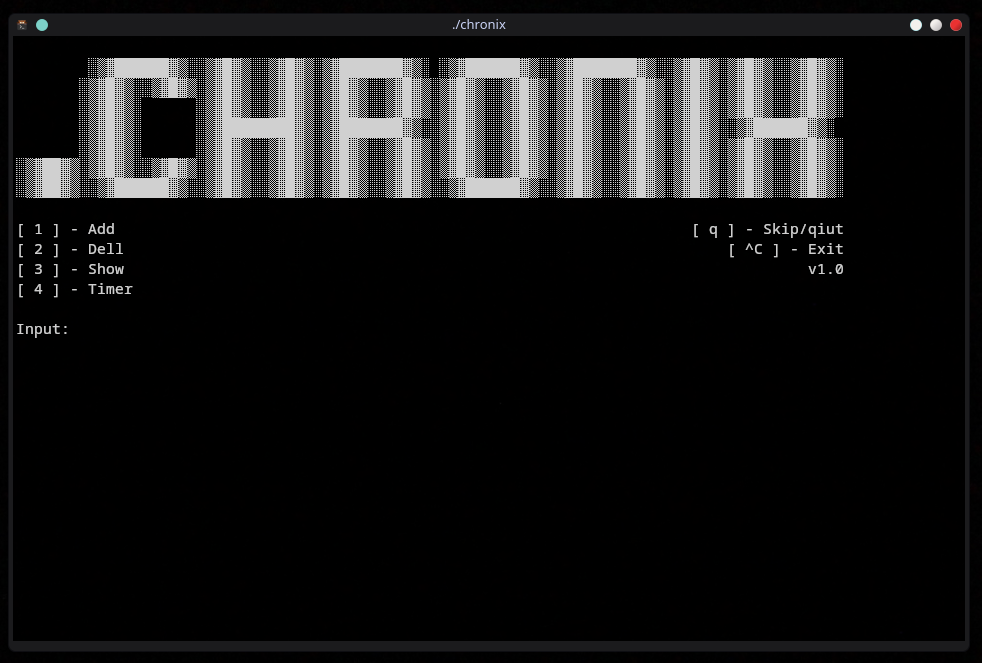

<div align="center">



<br>

<h1>.chronix v1.0</h1>

</div>

***Chronix*** is a simple console application for time tracking. It helps users see how much time they spend on different activities and visualizes this time in charts.

# Warning
> I WROTE EVERYTHING IN A SINGLE FILE JUST BECAUSE I CAN AND WANT TO. I WAS TOO LAZY TO DO IT PROPERLY. THIS PROJECT WAS MADE JUST FOR MYSELF AND I DON'T CARE ABOUT ANY RULES — I AM A PUNK.

# Screenshots




## Features

- **Timer**: Start a timer for a specific activity and track the time until stopped.  
- **Chart**: Visualize time as a chart where each column represents an activity.  
- **Auto-add**: Add time to an existing activity automatically.  
- **Console Control**: Simple and convenient menu for managing activities.

## How to Use

### 1. Launch
- Run the program in your console.

### 2. Add Activity
- Select the option to add a new activity.  
- Enter the activity name and the number of minutes spent on it.

### 3. Start Timer
- Choose the "Start Timer" option.  
- Select which activity the tracked time should be added to.  
- The timer will start and can be stopped by pressing **Enter**.

### 4. Delete Activity
- Choose the delete option to remove an activity from the list.

### 5. View Charts
- The program displays a chart using symbols to show the proportion of time for each activity.

---

## Installation

- Supported package managers: `pacman` (Arch/Manjaro);
- `g++` is required to compile the project.

### Clone and Build

```bash
git clone https://github.com/Tabyretkadp/.chronix.git
cd .chronix
g++ -o chronix chronix.cpp

